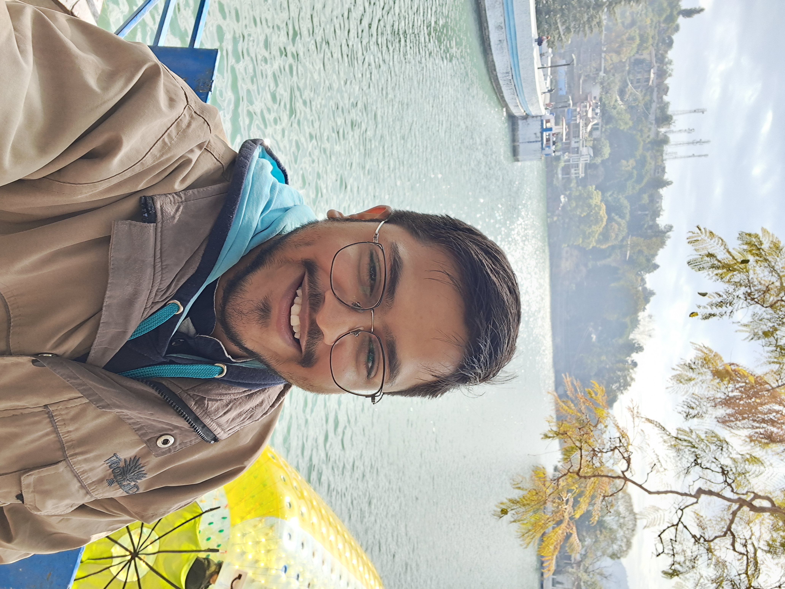

{:height="50%" width="50%"}

# About me!👋
I have a passion for exploring the frontiers of deep learning and computer vision, and how they can help us connect with each other and the world around us. I am pursuing a dual degree in Mathematics and Electrical And Electronics Engineering from Birla Institute of Technology and Sciences, Pilani – Hyderabad Campus. I love to experiment with data science and mathematics, travel to new places, and play video games.
{: style="text-align: justify"}
My research interests lie in natural language processing and computer vision, two domains that enable machines to understand and interact with human language and vision. You can find out more about my [Projects](/projects), [Work Experiences](/work), [Publications](/publications), [Resume](/Resume.pdf), and [Statistics Blog Post](/blogs) on this website.
{: style="text-align: justify"}

Last update: 20 Nov 2022.

